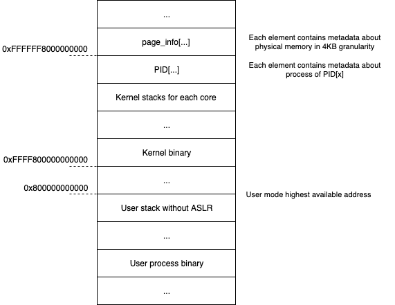

# Kernel for x64-64bit

This is an implementation of a simple kernel for x64 processors. It's a small project just to learn how operating systems work and understand recent security meltdowns.

### Features:

1. Memory management
   1. Buddy allocator, Slab allocator
   2. Pagging
      1. Virtual memory areas (VMA)
      2. Transparent Huge Pages (THP)
      3. Page canaries, Use-after-free, Double free
   3. User/kernel address space
      1. RIDL mitigation
      2. Foreshadow mitigation
      3. KPTI (todo)
      4. ASLR (todo)
   4. Demand paging
2. Process Management
   1. Interrupts
      1. Preemptive schedulling 
   2. Syscalls
      1. vdso (todo)
   3. Many processes
      1. User and Kernel threads
      2. Opening ELF binaries
   4. Scheduling
      1. Round-robin scheduler
   5. IPC messaging
3. Multi Core
   1. Core pinning
   2. Protect kernel with locks
4. Swapping
   1. Swapping uses' memory to the disk

### Operating system address space layout:

