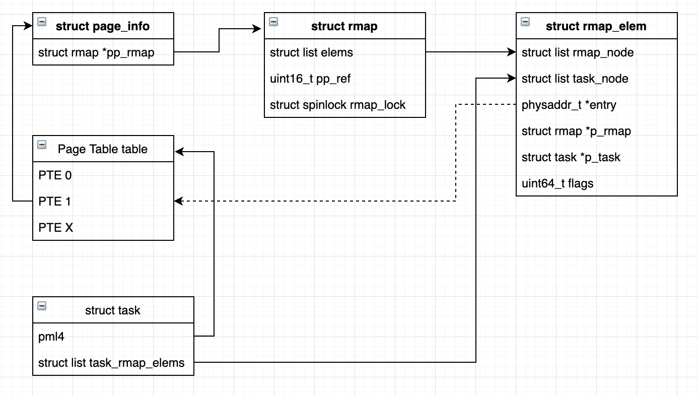
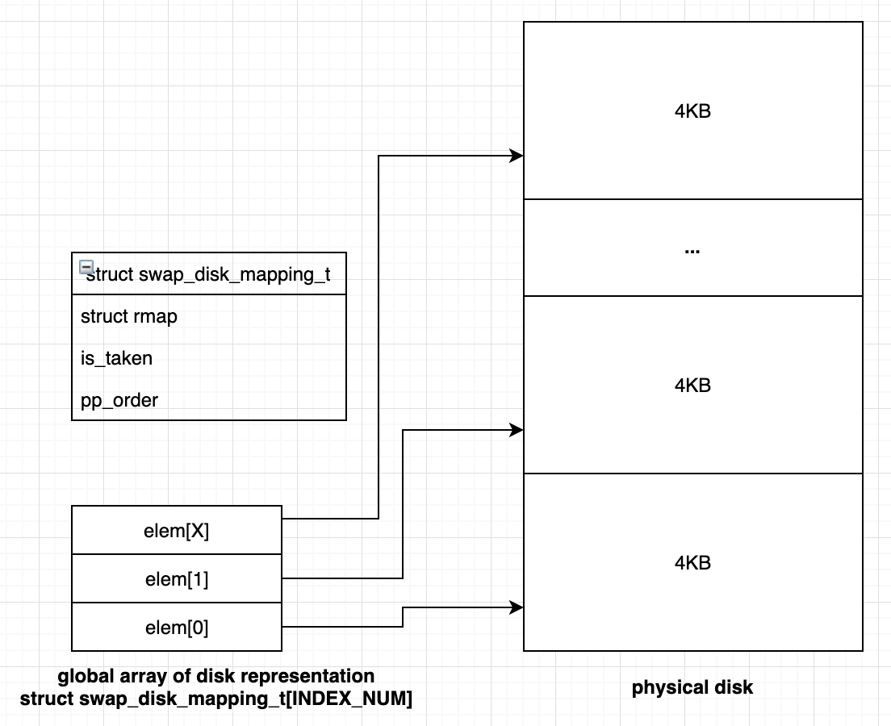
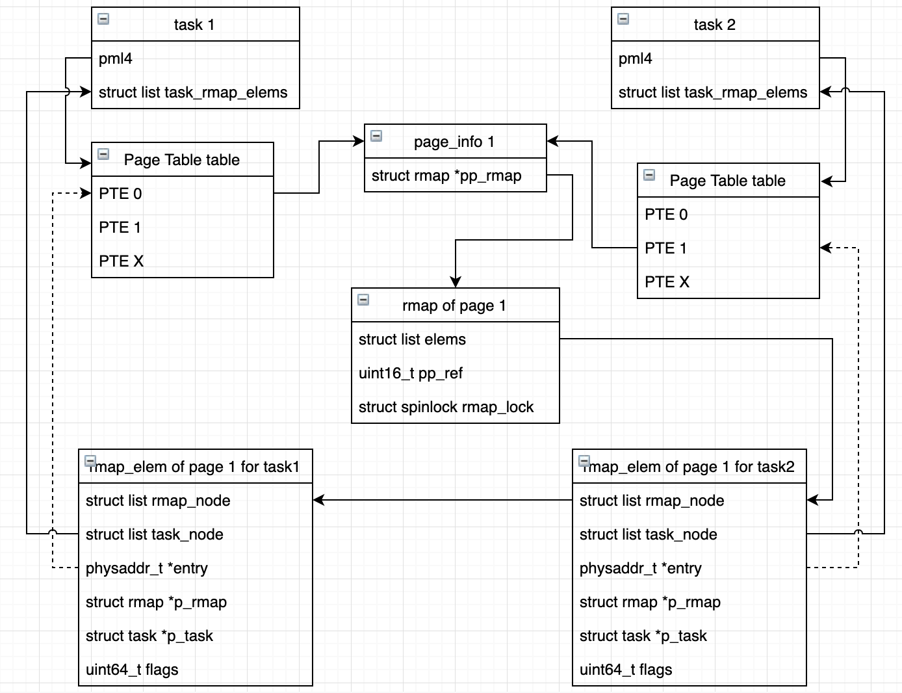

# Report Lab 7
This document gives a short general overview over our design by describing how the two components - OOM killer and swapping - interact together, before describing these subsystems and their data structures in more detail.

# Design Overview
The OOM killer and swapping are part of the memory management subsystem and only are fully active when there is a shortage of memory. In our kernel they are used synchronously and asynchronously. 

**Synchronously:** If the buddy allocator is unable to allocate a (huge) page, because of memory shortage, it tries to synchronously swap out pages until it's possible again to allocate the (huge) page. If there is not enough swap space to satisfy the allocation's need buddy synchronously calls the OOM killer. It calculates the badness score for all existing processes and kills the one with the highest. After freeing all resources buddy should be able to allocate the page again.

**Asynchronously:** When booting our kernel we also start a kernel task `swapd` which will only take action if the free memory drops below 20%. Even then it'll only run in intervals of `SWAPD_SCHEDULE_TIME_BLOCK`. If the memory is below 20% `swapd` keeps track of the LRU list and updates it regularly according to the `PAGE_ACCESSED` bit in the page table entries (PTEs) where the page is mapped. Once the free memory drops below 10% it additionaly starts swapping out pages and therefore tries to keep at least 10% free memory available.

## OOM Killer
The design of the OOM killer is straightforward. It gets only synchonously called from buddy if there is no physical memory available and we are out of swap space. It calculates the badness score for each user task as follows: `active phsycial pages*2 + swapped pages (if zombie + 5000)`. Then it prints the scores, chooses the task with the highest badness score and kills it. Therefore, it effectifely frees all the resources including user allocated physical pages, page tables and swap space. On success it returns control to buddy, which in turn then should be able to allocate a page. If we happen to kill the current task (because it had the highest badness score) then buddy will just yield, so that another task can be executed.

To optimize the calculation time of the badness scores the kernel keeps track of active physical pages and used swap space in the `task struct` whenever there's a page allocated, swapped in/out and dealloacted.

### Features
- counting of physical pages and swapped pages, so calculating badness scores is very fast
- easy to understand (and compute) badness score: active phsycial pages*2 + swapped pages
- zombies get bump of 5000 to make them very likely to get reaped first

### Limitations
- does not take page tables into account

## Swapping

The circular linked list `lru_pages` keeps track of all user pages in a least recently used manner. It is regularly updated by `swapd` according to the `PAGE_ACCESSED` bit in the PTEs where the page is mapped. When a page needs to be swapped the second chance / CLOCK algorithm is used to efficiently determine the next page to be swapped out. 

### Reverse mapping

In our design, reverse mapping *rmap* is implemented as an object that maintains a list of pointers to *rmap_elem*s. Each *rmap_elem* is a link between *page table entry*, *rmap* and a *task*, as shown on the Figure 1. This approach allows us to replace content of all page table entries that point to the same physical page, when the page is being swapped out. 

Figure 1. Reverse mapping design

#### Swap out

The swap out procedure is performed in the following way:

1. swap_out procedure knows the page_info it should transfer to the disk. Firstly, it extracts *rmap* object from *page_info* and iterate over all the elements in *elem* list.
   1. For each *rmap_elem* we update the page table entry for each pml4 structure as we store a direct pointer to it in *entry* field of *rmap_elem*. We clear PAGE_PRESENT bit and set the PAGE_SWAP bit in the page table entry and replace the current physical address of the page with an offset within the *global array of disk representation*. The design on the global array is shown below.

Figure 2. Global array of disk representation

Below, we present an example(Figure 2) that shows swapping out a page that was used in many page table entries by different tasks. When swapping out a page, we can easily identify all the rmap_elems, as they are stored in *pp_rmap* field of *page_info*. Therefore, we can easily update necessary page table entries.

Figure 3. Swap out a page that was held by many page table entries

#### Swap in

Swap in mechanism starts from the page table entry that has PAGE_SWAP bit set. We extract offset to the global disk representation and retrive the pointer to the *rmap*. Then we alloc a new page with page_alloc and copy over the data from the disk. Finally we find all the page table entries that we need to update by interating over *elems* list of *rmap*.

## Features

#### Async operation on disk

Disk opeartions are by far the most expensive part of swapping in and out, so in our implementation, we interrupt the task and move it to the waiting queue whenever it waits wait until the disk operation is completed by the current task or other tasks. However, in our codebase we give user an option to turn on and off the async feature by specifying a relevant flag `SWAP_SYNC_BACKGROUND` or `SWAP_SYNC_DIRECT`.

### Limitations

